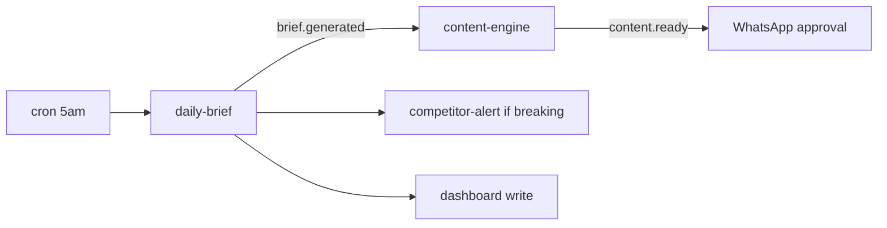
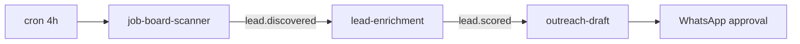
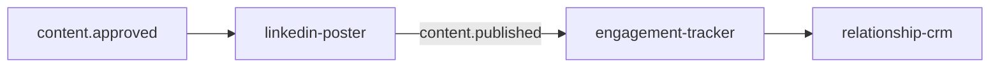

# Juno — full project guide (autonomous executive team)

This is the **canonical blueprint** for the agentic architecture: **Inngest** orchestrates cron + events; agents are **not chatbots waiting for input** — they wake on a schedule or on events, chain work, and surface what matters (dashboard, email, WhatsApp approvals).

**Relationship to this repo:** Today the code lives under **`lib/inngest/`** and **`app/api/inngest/`** (no `src/`). The tree below is the **target layout** to grow into; names can stay under `lib/inngest/functions/` instead of a separate `juno/` root.

---

## 1. Project structure

```
lib/inngest/                          # orchestration (Inngest)
├── client.ts                         # Inngest app client (id: idea2startup)
├── functions/
│   ├── cbs/                          # Chief Business Strategist
│   │   ├── daily-brief.ts            # cron · e.g. 5am — emits brief.generated
│   │   ├── competitor-monitor.ts     # cron · e.g. every 4h
│   │   └── funding-alert.ts          # event: funding.detected
│   ├── cro/                          # Chief Research Officer
│   │   ├── job-board-scanner.ts      # cron · e.g. every 4h — emits lead.discovered
│   │   ├── lead-enrichment.ts        # event: lead.discovered → emits lead.scored
│   │   └── customer-discovery.ts     # cron · daily
│   ├── cmo/                          # Chief Marketing Officer
│   │   ├── content-engine.ts         # event: brief.generated
│   │   ├── linkedin-poster.ts        # event: content.approved
│   │   ├── comment-engine.ts         # cron · e.g. every 2h
│   │   └── relationship-crm.ts       # event: interaction.*
│   ├── cto/                          # Chief Technology Officer (tech radar & platform)
│   │   ├── tech-radar.ts             # cron · daily
│   │   └── platform-poster.ts        # event: content.approved
│   ├── cfo/                          # (optional — matches current dashboard CFO tools)
│   └── coo/                          # (optional — matches current dashboard COO tools)
├── agents/                           # Agent definitions (e.g. AgentKit) — cbs, cro, cmo, cto
└── tools/                            # shared capabilities
    ├── scrapers.ts                   # arXiv, Crunchbase, Product Hunt, news
    ├── linkedin.ts                   # post, comment, connect
    ├── whatsapp.ts                   # Twilio delivery / approval prompts
    ├── job-boards.ts                 # LinkedIn Jobs, Indeed
    └── enrichment.ts                 # company data (e.g. BuiltWith-style)

lib/                                  # shared app logic (already exists)
├── company-context.ts                # assembled agent context (profile + assets + memory)
├── scoring.ts                        # relevance scoring (Claude) — to add / expand
└── brief-formatter.ts                # WhatsApp / email / dashboard formatting — to add

app/api/
├── inngest/route.ts                  # Inngest serve() — GET/POST/PUT
└── approval/route.ts                 # (future) WhatsApp webhook — human-in-the-loop approvals
```

**Legend**

| Label | Meaning |
|-------|---------|
| **cron** | Scheduled function (`triggers: [{ cron: "..." }]`) |
| **event** | Triggered by `step.sendEvent` / `inngest.send` from upstream functions |

**Note:** The live product sidebar today includes **CFO** and **COO**; this guide adds **CTO** for tech-radar / platform flows. Map CFO/COO financial-ops tools into `functions/cfo/` and `functions/coo/` as you implement them.

---

## 2. Event flow graphs

### A. Daily intelligence & content



- **`daily-brief`** runs on cron → emits **`brief.generated`**.
- **`content-engine`** consumes **`brief.generated`** → emits **`content.ready`** → **WhatsApp** (or in-app) **approval**.
- Optional: **competitor-alert** if breaking news; **dashboard** persistence.

### B. Lead generation



- **`job-board-scanner`** → **`lead.discovered`** (aligns with **`juno/lead.discovered`** in `architecture-agentic-inngest.md`).
- **`lead-enrichment`** → **`lead.scored`**.
- **`outreach-draft`** (e.g. CMO) → approval gate before send.

### C. Social & CRM



- **`linkedin-poster`** listens for **`content.approved`** (human or policy-approved).
- **`content.published`** feeds **engagement** → **relationship-crm** updates.

---

## 3. Event catalog (names to standardize)

| Event | Emitted by | Consumed by |
|-------|------------|----------------|
| `brief.generated` | daily-brief | content-engine, competitor paths |
| `content.ready` | content-engine | approval layer |
| `content.approved` | approval webhook | linkedin-poster, platform-poster |
| `content.published` | linkedin-poster | engagement-tracker, CRM |
| `lead.discovered` | job-board-scanner / brief | lead-enrichment |
| `lead.scored` | lead-enrichment | outreach-draft |
| `funding.detected` | monitors | funding-alert |
| `interaction.*` | social / CRM | relationship-crm |

Prefix with `juno/` if you want a single namespace in Inngest (e.g. `juno/lead.discovered`) — see `docs/architecture-agentic-inngest.md`.

---

## 4. Human-in-the-loop

Sensitive steps (**LinkedIn post**, **outreach send**) go through **approval** (WhatsApp webhook in **`approval.ts`**, or in-app inbox). Approved actions emit **`content.approved`** (or equivalent) to unlock posters.

---

## 5. Environment (guide-level)

| Area | Typical secrets |
|------|------------------|
| LLM | `ANTHROPIC_API_KEY` |
| Inngest | `INNGEST_SIGNING_KEY`, optional `INNGEST_EVENT_KEY` |
| WhatsApp | Twilio / Meta — see `whatsapp.ts` |
| Data | `EXA_API_KEY`, Crunchbase, etc. |
| App | Supabase, Supermemory (existing) |

---

## 6. Implementation order (suggested)

1. **Keep** `serve` + split **`junoPing`** into role folders as you add real functions.
2. **daily-brief** cron → emit **`brief.generated`** (stub payload first).
3. **lead.discovered** chain: scanner stub → **lead-enrichment** stub → persist.
4. **Approval** route + **`content.approved`** before any external post.
5. **tools/**: implement **scrapers** + **enrichment** behind one interface each.

---

## 7. Related docs

| Doc | Content |
|-----|---------|
| [architecture-agentic-inngest.md](./architecture-agentic-inngest.md) | Principles, `sendEvent`, `juno/lead.*` |
| [inngest-setup.md](./inngest-setup.md) | Enable Inngest in prod |
| [backend-overview.md](./backend-overview.md) | Current APIs & DB |

---

### Implemented in repo (starter)

| Area | Location |
|------|----------|
| CBS daily brief | `lib/inngest/functions/cbs/daily-brief.ts` — cron fan-out + `juno/daily-brief.run` |
| CMO content | `lib/inngest/functions/cmo/content-engine.ts` — `juno/brief.generated` |
| CRO leads | `lib/inngest/functions/cro/job-pipeline.ts` — scanner / enrichment / outreach stubs |
| Scrapers | `lib/juno/scrapers.ts` — **ArXiv live**; news / PH / Crunchbase / jobs **stub** |
| Context for jobs | `lib/company-context-admin.ts` (service role) |
| Manual trigger | `POST /api/juno/trigger-daily-brief` |

*This guide is the north star for restructuring `lib/inngest/functions/` into role-based modules and event chains.*
